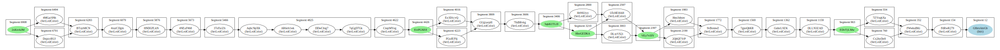

# Aranya Embedded Storage Dumper

This tool consumes an internal storage partition dump and produces a GraphViz
"dot" file describing the Aranya graph.

## Usage

```
$ aranya-embedded-storage-dumper partition.bin out.dot
```

## Example graph

<a href="graph-example.svg">
  
</a>
